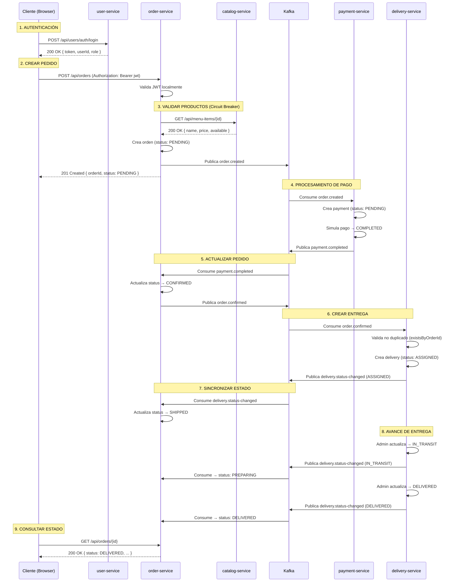

# Sistema de Pedidos de Comida — Food Order System
## Documento de Arquitectura Técnica

**Autor:** Felipe Palomino Sotelo  
**Estilo arquitectónico:** Microservicios + Event-Driven Architecture (EDA) + Clean Architecture  
**Fecha:** Agosto 2026

---

## 1. Resumen Ejecutivo

Sistema distribuido de pedidos de comida para **múltiples restaurantes**, implementado con arquitectura de microservicios. Compuesto por **5 servicios independientes** (usuarios, catálogo, pedidos, pagos, entregas), cada uno con su propia base de datos PostgreSQL y comunicación mediante **REST síncrono** y **eventos asíncronos vía Kafka**.

### 1.1 Objetivos de diseño

- **Separación de responsabilidades:** Cada microservicio maneja un dominio específico con base de datos propia (Database per Service pattern)
- **Comunicación híbrida:** REST para consultas síncronas críticas + Kafka para flujos asíncronos transaccionales
- **Resiliencia:** Circuit Breaker y Retry en comunicaciones síncronas críticas
- **Seguridad distribuida:** JWT emitido centralizadamente, validado localmente por cada servicio
- **Observabilidad completa:** Métricas (Prometheus/Grafana), trazabilidad distribuida (Zipkin)
- **Clean Architecture:** Aislamiento del dominio de la infraestructura en cada servicio

### 1.2 Características principales

- Multi-restaurante (catálogo dinámico por restaurante)
- Gestión completa de pedidos con flujo estado
- Procesamiento de pagos automático vía eventos Kafka
- Asignación de entregas automática tras pago exitoso
- Frontend SPA con JavaScript vanilla
- Despliegue en Docker y Kubernetes

### 1.3 Fuera de alcance

API Gateway centralizado, service mesh, notificaciones push/email, recuperación de contraseña, panel de administración completo.

---

## 2. Stack Tecnológico

| Categoría | Tecnología |
|---|---|
| **Lenguaje** | Java 21 |
| **Framework Backend** | Spring Boot 3.x |
| **Persistencia** | Spring Data JPA + Hibernate |
| **Base de Datos** | PostgreSQL 15 (una por servicio) |
| **Migraciones** | Flyway |
| **Mensajería** | Apache Kafka 3.x (modo KRaft) |
| **Seguridad** | Spring Security + JWT (HS256) |
| **Resiliencia** | Resilience4j (Circuit Breaker + Retry) |
| **Métricas** | Micrometer + Prometheus |
| **Trazabilidad** | Spring Cloud Sleuth + Zipkin |
| **Frontend** | HTML5 + CSS3 + JavaScript (vanilla) |
| **Contenerización** | Docker + Docker Compose |
| **Orquestación** | Kubernetes (Minikube/local) |
| **Observabilidad** | Prometheus + Grafana + Zipkin |
| **Arquitectura Interna** | Clean Architecture (domain / application / infrastructure) |

---

## 3. Arquitectura General

### 3.1 Diagrama de componentes

```
┌─────────────┐
│   Cliente   │ (Frontend JS)
│  Browser    │
└──────┬──────┘
       │ HTTP + JWT
       │
       ├────────────────┬─────────────┬──────────────┬───────────────┐
       │                │             │              │               │
   ┌───▼────┐      ┌────▼───┐   ┌────▼────┐   ┌─────▼──────┐  ┌────▼──────┐
   │  User  │      │Catalog │   │  Order  │   │  Payment   │  │ Delivery  │
   │Service │      │Service │   │ Service │   │  Service   │  │  Service  │
   │:8081   │      │:8082   │   │  :8083  │   │   :8085    │  │   :8084   │
   └───┬────┘      └────┬───┘   └────┬────┘   └─────┬──────┘  └────┬──────┘
       │                │             │              │               │
       │                │             │ Circuit      │               │
       │                │             │ Breaker      │               │
       │                │             └──────────────►               │
       │                │              REST                          │
       │                │                                            │
   ┌───▼────┐      ┌────▼───┐   ┌────▼────┐   ┌─────▼──────┐  ┌────▼──────┐
   │postgres│      │postgres│   │postgres │   │  postgres  │  │ postgres  │
   │ -user  │      │-catalog│   │ -order  │   │  -payment  │  │ -delivery │
   │ :5434  │      │ :5433  │   │  :5435  │   │   :5436    │  │   :5437   │
   └────────┘      └────────┘   └────┬────┘   └─────┬──────┘  └────┬──────┘
                                     │              │               │
                                     └──────┬───────┴───────────────┘
                                            │ Kafka Events
                                     ┌──────▼────────┐
                                     │  Apache Kafka │
                                     │  + Zookeeper  │
                                     │    :9092      │
                                     └───────────────┘
```

### 3.2 Principios arquitectónicos

1. **Database per Service:** Cada microservicio tiene su propia BD PostgreSQL
2. **Smart endpoints, dumb pipes:** Lógica de negocio en los servicios, no en middleware
3. **Comunicación síncrona mínima:** Solo `order-service → catalog-service` (validar productos)
4. **Coreografía de eventos:** Flujo transaccional (pago → entrega) sin orquestador central
5. **Autenticación centralizada, autorización distribuida:** JWT validado localmente
6. **Failure isolation:** Circuit Breaker en llamadas REST críticas
7. **Clean Architecture:** Dominio independiente del framework en cada servicio

---

## 4. Servicios del Sistema

### 4.1 User Service (Puerto 8081)

**Responsabilidad:** Autenticación, autorización y gestión de usuarios.

**Endpoints:**

| Método | Endpoint | Acceso | Descripción |
|--------|----------|--------|-------------|
| POST | `/api/users/auth/register` | Público | Registrar nuevo usuario |
| POST | `/api/users/auth/login` | Público | Login y obtención de JWT |
| GET | `/api/users` | ADMIN | Listar todos los usuarios |
| GET | `/api/users/{id}` | Autenticado | Obtener usuario por ID |
| PUT | `/api/users/{id}` | Propietario | Actualizar perfil |
| DELETE | `/api/users/{id}` | ADMIN | Eliminar usuario |

**Modelo de datos — tabla `users`:**
```sql
id BIGSERIAL PRIMARY KEY
name VARCHAR(100) NOT NULL
email VARCHAR(100) UNIQUE NOT NULL
password_hash VARCHAR(255) NOT NULL
phone VARCHAR(20)
address VARCHAR(255)
role VARCHAR(20) NOT NULL  -- CUSTOMER, ADMIN, RESTAURANT_OWNER
created_at TIMESTAMP DEFAULT NOW()
updated_at TIMESTAMP DEFAULT NOW()
```

**Roles disponibles:** `CUSTOMER`, `ADMIN`, `RESTAURANT_OWNER`

**JWT emitido:** Claims `{ sub: userId, email, role, iat, exp }` firmado con HS256.

---

### 4.2 Catalog Service (Puerto 8082)

**Responsabilidad:** Gestión de restaurantes y sus menús.

**Endpoints:**

| Método | Endpoint | Acceso | Descripción |
|--------|----------|--------|-------------|
| GET | `/api/restaurants` | Público | Listar restaurantes activos |
| GET | `/api/restaurants/{id}` | Público | Obtener restaurante por ID |
| POST | `/api/restaurants` | ADMIN | Crear nuevo restaurante |
| PUT | `/api/restaurants/{id}` | ADMIN | Actualizar restaurante |
| DELETE | `/api/restaurants/{id}` | ADMIN | Eliminar restaurante |
| GET | `/api/restaurants/{id}/menu` | Público | Obtener menú del restaurante |
| GET | `/api/menu-items/{id}` | Público | Obtener item de menú por ID |
| POST | `/api/restaurants/{id}/menu` | ADMIN | Crear item de menú |
| PUT | `/api/menu-items/{id}` | ADMIN | Actualizar item (precio, disponibilidad) |
| DELETE | `/api/menu-items/{id}` | ADMIN | Eliminar item del menú |

**Modelos de datos:**

**Tabla `restaurants`:**
```sql
id BIGSERIAL PRIMARY KEY
name VARCHAR(100) NOT NULL
type VARCHAR(50)           -- PESCADOS, CRIOLLA, PASTAS, etc.
description TEXT
address VARCHAR(255)
active BOOLEAN DEFAULT TRUE
created_at TIMESTAMP DEFAULT NOW()
updated_at TIMESTAMP DEFAULT NOW()
```

**Tabla `menu_items`:**
```sql
id BIGSERIAL PRIMARY KEY
restaurant_id BIGINT NOT NULL REFERENCES restaurants(id)
name VARCHAR(100) NOT NULL
description TEXT
price DECIMAL(10,2) NOT NULL
category VARCHAR(50)       -- ENTRADA, PLATO_PRINCIPAL, POSTRE, BEBIDA
available BOOLEAN DEFAULT TRUE
created_at TIMESTAMP DEFAULT NOW()
updated_at TIMESTAMP DEFAULT NOW()
```

**Comunicación entrante:** Invocado sincrónicamente por `order-service` para validar items al crear pedido.

---

### 4.3 Order Service (Puerto 8083)

**Responsabilidad:** Creación y gestión del ciclo de vida de pedidos.

**Endpoints:**

| Método | Endpoint | Acceso | Descripción |
|--------|----------|--------|-------------|
| POST | `/api/orders` | CUSTOMER | Crear nuevo pedido |
| GET | `/api/orders` | ADMIN | Listar todos los pedidos |
| GET | `/api/orders/{id}` | Propietario/ADMIN | Obtener pedido por ID |
| GET | `/api/orders/user/{userId}` | Propietario/ADMIN | Pedidos de un usuario |
| PATCH | `/api/orders/{id}/status` | ADMIN | Actualizar estado manualmente |
| DELETE | `/api/orders/{id}` | Propietario/ADMIN | Cancelar pedido |

**Modelos de datos:**

**Tabla `orders`:**
```sql
id BIGSERIAL PRIMARY KEY
user_id BIGINT NOT NULL
restaurant_id BIGINT NOT NULL
total_amount DECIMAL(10,2) NOT NULL
status VARCHAR(30) NOT NULL  -- Ver máquina de estados
delivery_address VARCHAR(255)
created_at TIMESTAMP DEFAULT NOW()
updated_at TIMESTAMP DEFAULT NOW()
```

**Tabla `order_items`:**
```sql
id BIGSERIAL PRIMARY KEY
order_id BIGINT NOT NULL REFERENCES orders(id) ON DELETE CASCADE
menu_item_id BIGINT NOT NULL
menu_item_name VARCHAR(100) NOT NULL  -- snapshot
quantity INTEGER NOT NULL
unit_price DECIMAL(10,2) NOT NULL     -- snapshot
subtotal DECIMAL(10,2) NOT NULL
```

**Máquina de estados:**
```
PENDING → CONFIRMED → SHIPPED → PREPARING → READY → DELIVERED
    ↓
CANCELLED
```

**Estados disponibles:** `PENDING`, `CONFIRMED`, `SHIPPED`, `PREPARING`, `READY`, `DELIVERED`, `CANCELLED`

**Eventos publicados:**
- `order.created` → consumido por `payment-service`
- `order.confirmed` → consumido por `delivery-service`

**Eventos consumidos:**
- `payment.completed` (actualiza status → CONFIRMED)
- `delivery.status-changed` (sincroniza estados)

**Comunicación síncrona:** Llama a `catalog-service` vía REST para validar productos, precios y disponibilidad al crear pedido. **Protegido con Circuit Breaker y Retry** (Resilience4j).

---

### 4.4 Payment Service (Puerto 8085)

**Responsabilidad:** Procesamiento automático de pagos.

**Endpoints:**

| Método | Endpoint | Acceso | Descripción |
|--------|----------|--------|-------------|
| POST | `/api/payments` | Sistema | Procesar pago (invocado automáticamente) |
| GET | `/api/payments` | ADMIN | Listar todos los pagos |
| GET | `/api/payments/{id}` | Propietario/ADMIN | Obtener pago por ID |
| GET | `/api/payments/order/{orderId}` | Propietario/ADMIN | Obtener pago de un pedido |
| PATCH | `/api/payments/{id}/confirm` | Sistema | Confirmar pago |
| PATCH | `/api/payments/{id}/status` | ADMIN | Cambiar estado manualmente (demo) |

**Modelo de datos — tabla `payments`:**
```sql
id BIGSERIAL PRIMARY KEY
order_id BIGINT UNIQUE NOT NULL
user_id BIGINT NOT NULL
amount DECIMAL(10,2) NOT NULL
method VARCHAR(30)             -- CASH, CARD, ONLINE
status VARCHAR(30) NOT NULL    -- PENDING, COMPLETED, FAILED
transaction_ref VARCHAR(100)
created_at TIMESTAMP DEFAULT NOW()
```

**Estados disponibles:** `PENDING`, `COMPLETED`, `FAILED`

**Flujo automático:**
1. Consume evento `order.created` de Kafka
2. Crea registro de pago automáticamente (status: `PENDING`)
3. Procesa pago (simulación automática)
4. Publica evento según resultado:
   - `payment.completed` (si éxito) → consumido por `order-service` y `delivery-service`
   - `payment.failed` (si fallo) → consumido por `order-service`

**Eventos consumidos:**
- `order.created`

**Eventos publicados:**
- `payment.completed`
- `payment.failed`

---

### 4.5 Delivery Service (Puerto 8084)

**Responsabilidad:** Gestión de entregas una vez aprobado el pago.

**Endpoints:**

| Método | Endpoint | Acceso | Descripción |
|--------|----------|--------|-------------|
| GET | `/api/deliveries/order/{orderId}` | Autenticado | Obtener entrega de un pedido |
| PATCH | `/api/deliveries/{id}/status` | ADMIN | Actualizar estado de entrega |

**Modelo de datos — tabla `deliveries`:**
```sql
id BIGSERIAL PRIMARY KEY
order_id BIGINT UNIQUE NOT NULL
user_id BIGINT NOT NULL
delivery_address VARCHAR(255)
status VARCHAR(30) NOT NULL    -- PENDING, ASSIGNED, IN_TRANSIT, DELIVERED
estimated_minutes INTEGER
created_at TIMESTAMP DEFAULT NOW()
updated_at TIMESTAMP DEFAULT NOW()
```

**Estados disponibles:** `PENDING`, `ASSIGNED`, `IN_TRANSIT`, `DELIVERED`

**Flujo automático:**
1. Consume evento `payment.completed` de Kafka
2. Crea registro de entrega automáticamente (status: `PENDING` → `ASSIGNED`)
3. Publica `delivery.status-changed` cada vez que cambia el estado
4. `order-service` sincroniza su estado según los cambios de entrega

**Eventos consumidos:**
- `payment.completed` (desde `payment-service`)
- `order.confirmed` (desde `order-service`)

**Eventos publicados:**
- `delivery.status-changed`

**Validación de duplicados:** Implementa verificación de existencia antes de crear entrega para evitar duplicados por redelivery de Kafka.

---

## 5. Contratos de Eventos (Kafka)

### 5.1 Topics configurados

| Topic | Productor | Consumidores | Propósito |
|-------|-----------|--------------|-----------|
| `order.created` | order-service | payment-service | Disparar proceso de pago |
| `order.confirmed` | order-service | delivery-service | Crear entrega tras confirmar pedido |
| `payment.completed` | payment-service | order-service, delivery-service | Notificar pago exitoso |
| `payment.failed` | payment-service | order-service | Notificar pago fallido |
| `delivery.status-changed` | delivery-service | order-service | Sincronizar estados de entrega |

### 5.2 Estructura de mensajes

**Ejemplo: `order.created`**
```json
{
  "eventType": "ORDER_CREATED",
  "orderId": 123,
  "userId": 456,
  "totalAmount": 45.50,
  "deliveryAddress": "Av. Principal 123, Lima"
}
```

**Ejemplo: `payment.completed`**
```json
{
  "eventType": "PAYMENT_COMPLETED",
  "orderId": 123,
  "paymentId": 789,
  "amount": 45.50,
  "method": "ONLINE",
  "transactionRef": "TXN-ABC123"
}
```

**Ejemplo: `delivery.status-changed`**
```json
{
  "eventType": "DELIVERY_STATUS_CHANGED",
  "orderId": 123,
  "deliveryId": 456,
  "status": "IN_TRANSIT"
}
```

### 5.3 Garantías de entrega

- **At-least-once delivery:** Kafka garantiza que los mensajes se entregan al menos una vez
- **Idempotencia:** Cada consumidor valida existencia antes de procesar (evita duplicados)
- **Consumer groups:** Cada servicio usa su propio `group.id` para consumo independiente

---

## 6. Seguridad

### 6.1 Autenticación con JWT

**Emisor:** `user-service` (único punto de emisión)

**Algoritmo:** HS256 (secreto compartido configurado en variable `JWT_SECRET`)

**Claims del token:**
```json
{
  "sub": "4",           // userId
  "email": "user@example.com",
  "role": "CUSTOMER",
  "iat": 1692000000,
  "exp": 1692086400     // 24 horas de validez
}
```

**Flujo:**
1. Cliente hace POST `/api/users/auth/login` con credenciales
2. `user-service` valida y retorna JWT
3. Cliente incluye token en header: `Authorization: Bearer <jwt>`
4. Cada servicio valida JWT **localmente** (sin llamadas de red)

### 6.2 Autorización por roles

**Roles soportados:**
- `CUSTOMER`: Usuarios finales (crear pedidos, ver sus propios datos)
- `ADMIN`: Administradores (acceso total)
- `RESTAURANT_OWNER`: Dueños de restaurantes (gestión de menús)

**Validación:**
- Endpoint público: Sin validación
- Endpoint autenticado: Valida firma y expiración del JWT
- Endpoint con ownership: Valida que `userId` del recurso = `sub` del token
- Endpoint admin: Valida que `role` = `ADMIN`

### 6.3 CORS

Configurado con `@CrossOrigin(origins = "*")` en todos los controllers (simplificación para desarrollo/demo).

---

## 7. Resiliencia

### 7.1 Circuit Breaker

**Ubicación:** `order-service → catalog-service` (única llamada síncrona crítica)

**Configuración** (`order-service/src/main/resources/application.yaml`):
```yaml
resilience4j:
  circuitbreaker:
    instances:
      catalog-cb:
        slidingWindowSize: 5
        failureRateThreshold: 50
        waitDurationInOpenState: 10s
        permittedNumberOfCallsInHalfOpenState: 2
```

**Comportamiento:**
- **CLOSED (normal):** Todas las llamadas pasan directamente
- **OPEN (circuito abierto):** Tras 50% de fallos en ventana de 5 llamadas
  - No llama a `catalog-service` por 10 segundos
  - Retorna datos de fallback (producto genérico "No disponible")
- **HALF_OPEN:** Tras 10s, permite 2 llamadas de prueba
  - Si tienen éxito → vuelve a CLOSED
  - Si fallan → vuelve a OPEN

**Implementación:**
```java
// CatalogServiceClient.java línea 38
@CircuitBreaker(name = "catalog-cb", fallbackMethod = "getMenuItemFallback")
public Map<String, Object> getMenuItemById(Long menuItemId) {
    return restTemplate.getForObject(...);
}

// Método fallback líneas 55-62
public Map<String, Object> getMenuItemFallback(Long id, Throwable ex) {
    return Map.of(
        "id", id,
        "name", "Producto no disponible (catalog-service caído)",
        "price", "0.00",
        "available", false
    );
}
```

### 7.2 Retry (implícito en Kafka)

Los consumidores de Kafka reintentan automáticamente ante fallos temporales según configuración del broker. No se implementa retry manual en el código Java.

---

## 8. Observabilidad

### 8.1 Métricas (Prometheus + Grafana)

**Exposición:**
- Cada servicio expone `/actuator/prometheus`
- Prometheus escrape cada 15 segundos
- Grafana consume Prometheus como datasource

**Métricas clave:**
- Latencia HTTP (`http_server_requests_seconds`)
- Tasa de error HTTP (`http_server_requests_count{status="5xx"}`)
- Estado del Circuit Breaker (`resilience4j_circuitbreaker_state`)
- Lag de consumidores Kafka (`kafka_consumer_lag`)
- Pool de conexiones DB (`hikari_connections_active`)

### 8.2 Trazabilidad distribuida (Zipkin)

**Configuración:**
```yaml
# application.yaml de cada servicio
management:
  tracing:
    sampling:
      probability: 1.0
  zipkin:
    tracing:
      endpoint: http://localhost:9411/api/v2/spans
```

**Propagación de contexto:**
- **HTTP:** Headers `X-B3-TraceId`, `X-B3-SpanId` propagados automáticamente
- **Kafka:** Contexto de traza propagado en headers del mensaje (requiere `spring.kafka.template.observation-enabled: true`)

**Vista de traza completa:**
```
Cliente → order-service → catalog-service (REST)
                ↓ (Kafka)
          payment-service → order-service (Kafka)
                ↓ (Kafka)
          delivery-service → order-service (Kafka)
```

### 8.3 Health Checks

Cada servicio expone:
- `/actuator/health` — Estado general
- `/actuator/health/liveness` — Liveness probe (Kubernetes)
- `/actuator/health/readiness` — Readiness probe (Kubernetes)

---

## 9. Flujo End-to-End de un Pedido



---

## 10. Frontend

### 10.1 Estructura

```
front/
├── index.html          → Login/registro
├── catalog.html        → Catálogo de restaurantes y menú
├── checkout.html       → Confirmación y creación de pedido
├── tracking.html       → Seguimiento de pedido
├── css/
│   └── styles.css
└── js/
    ├── config.js       → URLs de servicios
    ├── auth.js         → Manejo de JWT y autenticación
    ├── utils.js        → Utilidades (localStorage, formato)
    ├── catalog.js      → Lógica del catálogo
    ├── checkout.js     → Lógica del checkout
    └── tracking.js     → Lógica de seguimiento
```

### 10.2 Comunicación con backend

**Todas las peticiones vía REST:**
```javascript
// utils.js
async function fetchWithAuth(url, options = {}) {
    const token = localStorage.getItem('auth_token');
    return fetch(url, {
        ...options,
        headers: {
            'Authorization': `Bearer ${token}`,
            'Content-Type': 'application/json',
            ...options.headers
        }
    });
}
```

**El frontend NO ve Kafka** — solo consume APIs REST. Kafka es comunicación backend-a-backend.

### 10.3 Flujo de usuario

1. **Login** (`index.html`) → Obtiene JWT → Guarda en localStorage
2. **Catálogo** (`catalog.html`) → Llama `GET /api/restaurants` y `GET /api/restaurants/{id}/menu`
3. **Carrito** (localStorage) → Agrega items sin llamadas al backend
4. **Checkout** (`checkout.html`) → Llama `POST /api/orders` → Guarda `orderId` en localStorage
5. **Tracking** (`tracking.html`) → Consulta `GET /api/orders/{id}`, `GET /api/payments/order/{id}`, `GET /api/deliveries/order/{id}`

---

## 11. Despliegue

### 11.1 Docker Compose

**Infraestructura levantada:**
- 5 bases de datos PostgreSQL (puertos 5433-5437)
- Kafka + Zookeeper (puerto 9092)
- Prometheus (puerto 9090)
- Grafana (puerto 3000)
- Zipkin (puerto 9411)
- pgAdmin (puerto 5050)

**Comando:**
```bash
docker-compose up -d
```

### 11.2 Microservicios (ejecución local)

Cada servicio se ejecuta con Maven:
```bash
cd order-service
mvn clean package
java -jar target/order-service-0.0.1-SNAPSHOT.jar
```

**Puertos:**
- user-service: 8081
- catalog-service: 8082
- order-service: 8083
- delivery-service: 8084
- payment-service: 8085

### 11.3 Kubernetes

Cada servicio tiene su carpeta `k8s/`:
```
k8s/
├── 00-namespace.yaml      → namespace: food-ordering
├── 01-configmap.yaml      → Variables de entorno
├── 02-secret.yaml         → Credenciales BD
├── 03-deployment.yaml     → Deployment + replicas
└── 04-service.yaml        → Service (ClusterIP/NodePort)
```

**Configuración de réplicas:**
```yaml
# 03-deployment.yaml línea 9
spec:
  replicas: 1  # Cambiar a 2 o 3 para alta disponibilidad
```

**Health checks:**
```yaml
# 03-deployment.yaml líneas 66-77
livenessProbe:
  httpGet:
    path: /actuator/health/liveness
    port: 8083
  initialDelaySeconds: 45
  periodSeconds: 10

readinessProbe:
  httpGet:
    path: /actuator/health/readiness
    port: 8083
  initialDelaySeconds: 30
  periodSeconds: 5
```

**Despliegue:**
```bash
kubectl apply -f k8s/00-namespace.yaml
kubectl apply -f order-service/k8s/
kubectl apply -f payment-service/k8s/
# ... resto de servicios
```

---

## 12. Decisiones de Diseño y Justificación

| Decisión | Justificación |
|----------|---------------|
| **Clean Architecture por servicio** | Aísla reglas de negocio del framework, facilita testing y mantenibilidad |
| **Database per Service** | Permite escalabilidad independiente y evita acoplamiento por BD |
| **Circuit Breaker en order→catalog** | Única llamada síncrona crítica; evita cascada de fallos si catalog-service cae |
| **Kafka para flujo transaccional** | Desacopla servicios, permite procesamiento asíncrono y tolerancia a fallos |
| **JWT con secreto compartido (HS256)** | Simplifica validación distribuida sin gestión de claves públicas |
| **Sin API Gateway** | Reduce complejidad en proyecto académico; cada servicio expone su API |
| **Pago automático vía eventos** | Simula flujo real de procesamiento asíncrono |
| **Validación de duplicados en delivery** | Previene creación de múltiples entregas por redelivery de Kafka (at-least-once) |
| **Frontend SPA sin framework** | Simplicidad y transparencia educativa sobre comunicación HTTP |
| **Flyway para migraciones** | Versionado de esquema BD, reproducibilidad en despliegues |
| **Prometheus + Grafana + Zipkin** | Observabilidad completa: métricas + trazabilidad distribuida |

---

## 13. Puntos de Mejora / Roadmap

### 13.1 Corto plazo
- [ ] Agregar `@Retryable` explícito en consumidores Kafka
- [ ] Implementar Dead Letter Queue (DLQ) para eventos fallidos
- [ ] Agregar validación de ownership en `delivery-service`
- [ ] Test de integración con Testcontainers

### 13.2 Mediano plazo
- [ ] API Gateway (Spring Cloud Gateway)
- [ ] Service discovery (Eureka/Consul)
- [ ] Configuración centralizada (Spring Cloud Config)
- [ ] Notificaciones email/SMS (SendGrid/Twilio)
- [ ] Panel de administración (React/Angular)

### 13.3 Largo plazo
- [ ] Service Mesh (Istio/Linkerd)
- [ ] Event Sourcing + CQRS
- [ ] Implementar Saga Pattern con orquestador
- [ ] Multi-tenancy (varios restaurantes independientes)
- [ ] Cache distribuido (Redis)

---

## 14. Referencias y Documentación

### 14.1 Repositorio
- **GitHub:** [food-order-system-felipe-palomino](https://github.com/...)

### 14.2 Swagger UI
Cada servicio expone documentación OpenAPI en:
- User Service: http://localhost:8081/swagger-ui.html
- Catalog Service: http://localhost:8082/swagger-ui.html
- Order Service: http://localhost:8083/swagger-ui.html
- Payment Service: http://localhost:8085/swagger-ui.html
- Delivery Service: http://localhost:8084/swagger-ui.html

### 14.3 Herramientas de monitoreo
- Prometheus: http://localhost:9090
- Grafana: http://localhost:3000 (admin/admin)
- Zipkin: http://localhost:9411
- pgAdmin: http://localhost:5050

---

## 15. Glosario

| Término | Definición |
|---------|------------|
| **Circuit Breaker** | Patrón que previene llamadas a servicios fallidos, evitando cascada de errores |
| **Clean Architecture** | Arquitectura en capas que aísla el dominio de la infraestructura |
| **Consumer Group** | Grupo de consumidores Kafka que reparten carga de un topic |
| **EDA** | Event-Driven Architecture — arquitectura basada en eventos |
| **Idempotencia** | Capacidad de procesar el mismo mensaje múltiples veces sin efectos duplicados |
| **JWT** | JSON Web Token — token firmado para autenticación stateless |
| **Liveness Probe** | Health check que determina si un contenedor está vivo |
| **Readiness Probe** | Health check que determina si un contenedor está listo para recibir tráfico |
| **Saga** | Patrón para transacciones distribuidas mediante eventos |
| **Trace** | Seguimiento de una petición a través de múltiples servicios |

---

**Documento actualizado:** Agosto 2026  
**Versión:** 1.0  
**Autor:** Felipe Palomino Sotelo

